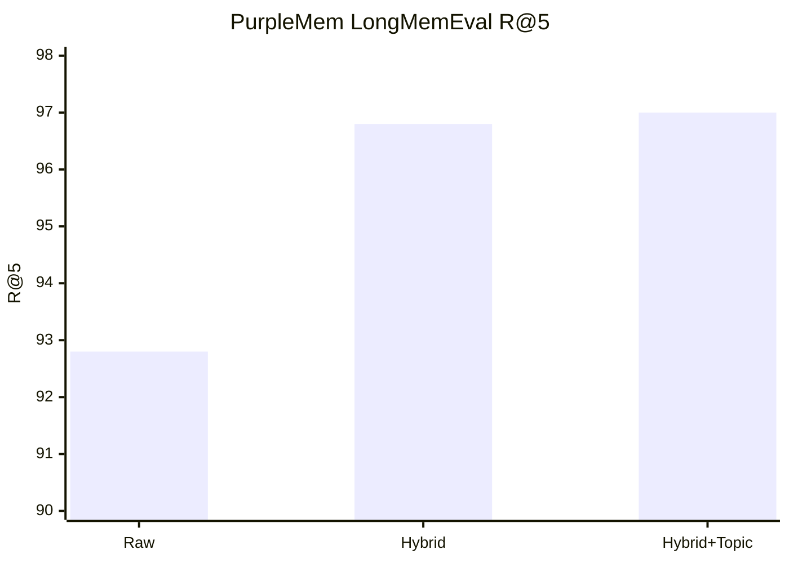

# Benchmark Results

## LongMemEval

Results generated from the public `benchmarks/longmemeval.py` runner.

| Variant | R@5 | R@10 | NDCG@10 |
| --- | ---: | ---: | ---: |
| Raw retrieval | 92.8 | 96.4 | 0.846 |
| Hybrid lexical reranking | 96.8 | 98.0 | 0.920 |
| Hybrid + topic signal | 97.0 | 98.4 | 0.922 |

## Quick visual

## Notes

- The largest improvement came from hybrid lexical reranking.
- Topic signal added a smaller gain on LongMemEval, even though it was mixed on one internal evaluation.
- These numbers measure the retrieval layer on verbatim session text.
